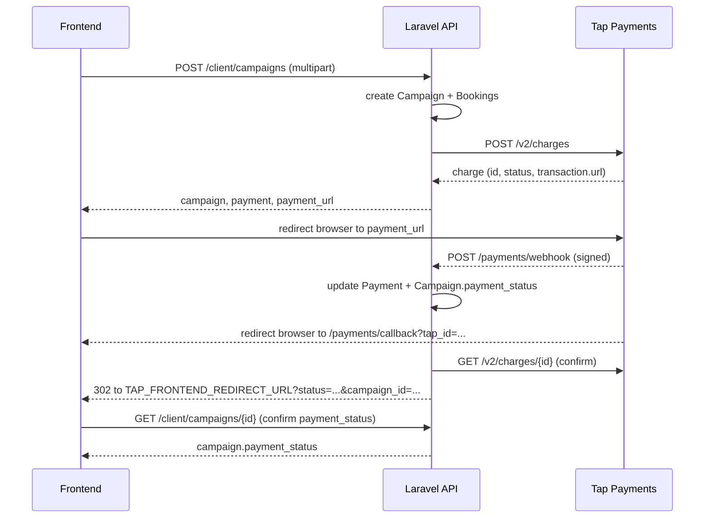

<p align="center"><a href="https://laravel.com" target="_blank"></a></p>

<p align="center">
<a href="https://github.com/laravel/framework/actions"></a>
<a href="https://packagist.org/packages/laravel/framework"></a>
<a href="https://packagist.org/packages/laravel/framework"></a>
<a href="https://packagist.org/packages/laravel/framework"></a>
</p>

## Campaign Payment Flow (Tap Payments) — Frontend Guide

This section is for the frontend team integrating with the "create campaign → pay" flow. Currency is **SAR**. All endpoints below except the Tap callback/webhook require a Sanctum bearer token (`Authorization: Bearer <token>`) as a `client`-type user.

### 1. Create the campaign — `POST /api/client/campaigns`

Send as `multipart/form-data` (there's a file field):

| Field | Type | Notes |
|---|---|---|
| `title` | string, required | max 255 |
| `description` | string, nullable | |
| `objective` | string, required | max 100 |
| `date_from` | date, required | `>= today` |
| `date_to` | date, required | `>= date_from` |
| `screen_ids[]` | array of ints, required | must be `approved` screens |
| `artwork` | file, nullable | jpg/jpeg/png/webp/mp4/mov, max 50MB |
| `needs_admin_artwork` | boolean, nullable | adds a flat artwork fee if true |

This single request creates the `Campaign` + one `Booking` per screen **and** initiates a Tap charge for the total (`sum(booking.sale_price) + artwork_fee`). Response (`201`):

```json
{
  "message": "Campaign submitted successfully. Complete payment to proceed.",
  "campaign": { "id": 42, "payment_status": "unpaid", "bookings": [ ... ], ... },
  "payment": { "id": 7, "status": "initiated", "amount": "3450.00", "currency": "SAR", ... },
  "payment_url": "https://checkout.tap.company/..."
}
```

**Frontend action:** if `payment_url` is present, immediately redirect the browser there (`window.location.href = payment_url`) — this is Tap's hosted checkout page.

**Payment-not-initiated case:** if Tap's API was unreachable, the campaign/bookings are still created (they don't roll back), but `payment_url` will be `null` and the message changes to `"Campaign submitted, but payment could not be initiated. Please retry payment."`. Show a "Retry payment" button in this case — see step 2.

### 2. Retry / resume payment — `POST /api/client/campaigns/{id}/pay`

Use this whenever a campaign's `payment_status` isn't `paid` yet and the user wants to (re)try — e.g. they closed the Tap tab, the charge was `declined`/`cancelled`, or step 1's Tap call failed. Same response shape as step 1 (`payment` + `payment_url`). Returns `422` if the campaign is already paid.

### 3. User completes checkout on Tap's hosted page

No frontend involvement here — Tap hosts the card/mada entry form at `payment_url`. When the user finishes (or cancels), Tap redirects the browser to our backend:

`GET /api/payments/callback?tap_id=chg_xxx`

Our backend re-fetches the charge from Tap server-to-server (it does **not** trust the query string), updates the `Payment` + `Campaign.payment_status`, and then 302-redirects the browser to:

```
{TAP_FRONTEND_REDIRECT_URL}?status={payment_status}&campaign_id={id}
```

`TAP_FRONTEND_REDIRECT_URL` is an env var the backend owns (`.env` → currently `http://localhost:3000/payment/result`) — **the frontend needs a route at that path** that reads `status` and `campaign_id` from the query string and shows a result screen.

`status` will be one of: `pending`, `initiated`, `captured`, `failed`, `cancelled`, `declined` — or `error` if something went wrong confirming the charge (check the `reason` query param in that case).

### 4. Confirm the final result

Tap also sends an independent, more reliable server-to-server webhook (`POST /api/payments/webhook`, signature-verified) that updates the same records — it can arrive slightly before or after the browser redirect in step 3. So treat the redirect's `status` query param as a **hint only**, and confirm by calling:

`GET /api/client/campaigns/{id}` → check `campaign.payment_status`:

| `payment_status` | Meaning |
|---|---|
| `unpaid` | Not paid yet — payment still `pending`/`initiated`, or nothing has succeeded |
| `paid` | Charge `captured` — booking is confirmed, proceed to success screen |
| `failed` | Charge `failed`/`declined`/`cancelled` — show a "Retry payment" button (step 2) |

If the redirect landed with `status=initiated`/`pending` but `campaign.payment_status` is still `unpaid`, poll `GET /api/client/campaigns/{id}` every couple of seconds a few times before giving up — the webhook is usually near-instant but isn't guaranteed to beat the browser redirect.

### Sequence



## Company Payouts (90/10 split) — How Owners Get Paid

There's no automatic bank transfer on capture — Tap just moves money into the platform's own merchant account. Getting it to a screen-owning company is a **balance ledger + manual withdrawal review** flow:

1. **Split**: each `Booking.sale_price` is split 90/10 at creation time (`Booking::COMMISSION_RATE = 0.10`) into `net_earned` (company) and `commission` (platform). A campaign can span screens from different companies, so the split is computed **per company, per booking** — not a flat 90% of the whole campaign. Artwork fees (`Campaign.artwork_fee`) are a platform-only service charge and are never split.
2. **Auto-credit on capture**: the moment a campaign's Tap charge is confirmed `CAPTURED` (webhook or callback — whichever lands first, guarded against double-firing with a row lock), each affected company's `users.balance` is incremented by its `net_earned` share. See `PaymentController::creditCompanyBalances()`.
3. **Owner requests a withdrawal** — `POST /api/company/withdraw-requests` with `amount`, `bank_name`, `account_holder_name`, `iban`. The amount is **reserved immediately** (deducted from `balance`) so it can't be requested twice; it's refunded back if rejected.
4. **Admin reviews it** — admins don't use the JSON API at all; they work through the existing **Filament panel** at `/admin` (session-based, its own login) under the **Fulfillment** nav group:
   - **Fulfillment → Withdraw Requests** (`app/Filament/Admin/Resources/WithdrawRequestResource.php`) — a table of every company's requests (tabs: All/Pending/Approved/Rejected) with row actions:
     - **Approve** — opens a modal requiring a `proof` file upload (screenshot/receipt of the bank transfer made *outside* the system). No balance change (already reserved in step 3). Calls `WithdrawRequest::approve()`.
     - **Reject** — opens a modal requiring a `reason`. Refunds the reserved amount back to `balance`. Calls `WithdrawRequest::reject()`.
     - **Proof** — downloads the approved request's proof file (visible once approved).
5. **Owner tracks status** via the JSON API — `GET /api/company/withdraw-requests?status=pending|approved|rejected`, and downloads the proof via `GET /api/company/withdraw-requests/{id}/invoice`.

**Owner earnings dashboard** — `GET /api/company/earnings` in one payload:

| Field | Meaning |
|---|---|
| `balance` | Current withdrawable balance |
| `total_revenue` | 100% of captured booking sale prices |
| `net_earnings` | 90% (their share) |
| `platform_fees` | 10% (shown for transparency) |
| `pending_payout` | Sum of their own withdraw requests still awaiting admin review |
| `monthly_earnings_trend` | Last 6 months, grouped by revenue/net/fees — for a grouped bar chart |
| `earnings_by_screen` | Net earnings per screen — for a bar chart |
| `payout_history` | Last 10 withdraw requests (full list: `/company/withdraw-requests`) |

**Admin fulfillment dashboard** — **Fulfillment → Dashboard** in the Filament panel (`app/Filament/Admin/Pages/Fulfillment.php`, at `/admin/fulfillment`): a pending-withdrawals stat + the platform's net earnings (10% commission + 100% of artwork fees, all-time) via `FulfillmentStatsWidget`, and a campaigns-created-vs-completed line chart (last 6 months) via `CampaignProgressChartWidget`. Both widgets set `$isDiscovered = false` so they only appear here, not on the main `/admin` dashboard alongside the unrelated platform-wide widgets.

Admin accounts have no public register endpoint (money-approval role) — provision one via `php artisan tinker`: `\App\Models\Admin::create([...])`, then log in at `/admin/login`. There's no `/api/admin/*` JSON API: clients and companies use the JSON API described elsewhere in this doc, but admin access is Filament-only.

## About Laravel

Laravel is a web application framework with expressive, elegant syntax. We believe development must be an enjoyable and creative experience to be truly fulfilling. Laravel takes the pain out of development by easing common tasks used in many web projects, such as:

- [Simple, fast routing engine](https://laravel.com/docs/routing).
- [Powerful dependency injection container](https://laravel.com/docs/container).
- Multiple back-ends for [session](https://laravel.com/docs/session) and [cache](https://laravel.com/docs/cache) storage.
- Expressive, intuitive [database ORM](https://laravel.com/docs/eloquent).
- Database agnostic [schema migrations](https://laravel.com/docs/migrations).
- [Robust background job processing](https://laravel.com/docs/queues).
- [Real-time event broadcasting](https://laravel.com/docs/broadcasting).

Laravel is accessible, powerful, and provides tools required for large, robust applications.

## Learning Laravel

Laravel has the most extensive and thorough [documentation](https://laravel.com/docs) and video tutorial library of all modern web application frameworks, making it a breeze to get started with the framework.

You may also try the [Laravel Bootcamp](https://bootcamp.laravel.com), where you will be guided through building a modern Laravel application from scratch.

If you don't feel like reading, [Laracasts](https://laracasts.com) can help. Laracasts contains thousands of video tutorials on a range of topics including Laravel, modern PHP, unit testing, and JavaScript. Boost your skills by digging into our comprehensive video library.

## Laravel Sponsors

We would like to extend our thanks to the following sponsors for funding Laravel development. If you are interested in becoming a sponsor, please visit the [Laravel Partners program](https://partners.laravel.com).

### Premium Partners

- **[Vehikl](https://vehikl.com/)**
- **[Tighten Co.](https://tighten.co)**
- **[WebReinvent](https://webreinvent.com/)**
- **[Kirschbaum Development Group](https://kirschbaumdevelopment.com)**
- **[64 Robots](https://64robots.com)**
- **[Curotec](https://www.curotec.com/services/technologies/laravel/)**
- **[Cyber-Duck](https://cyber-duck.co.uk)**
- **[DevSquad](https://devsquad.com/hire-laravel-developers)**
- **[Jump24](https://jump24.co.uk)**
- **[Redberry](https://redberry.international/laravel/)**
- **[Active Logic](https://activelogic.com)**
- **[byte5](https://byte5.de)**
- **[OP.GG](https://op.gg)**

## Contributing

Thank you for considering contributing to the Laravel framework! The contribution guide can be found in the [Laravel documentation](https://laravel.com/docs/contributions).

## Code of Conduct

In order to ensure that the Laravel community is welcoming to all, please review and abide by the [Code of Conduct](https://laravel.com/docs/contributions#code-of-conduct).

## Security Vulnerabilities

If you discover a security vulnerability within Laravel, please send an e-mail to Taylor Otwell via [taylor@laravel.com](mailto:taylor@laravel.com). All security vulnerabilities will be promptly addressed.

## License

The Laravel framework is open-sourced software licensed under the [MIT license](https://opensource.org/licenses/MIT).
